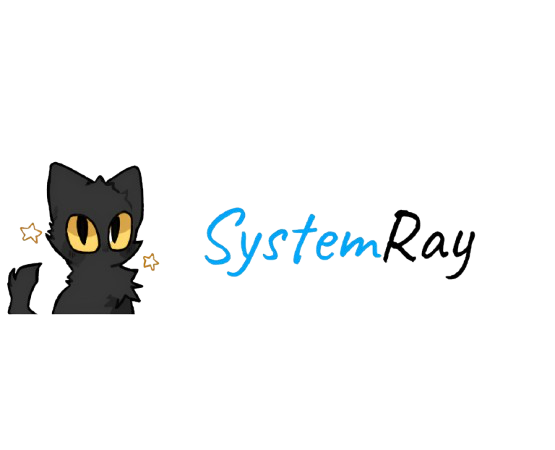

**SystemRay is a free tool for inspecting your system's health (available on Windows, Linux, MacOS)**

## How to start
1. Download an executable file from [release page](https://github.com/kasumitte/SystemRay/releases/latest) and run it directly. No additional installation required. 
2. To use builtin AI you must enter your API key in settings ("Groq" API key is preferable to use, you can get your own [here](https://console.groq.com/keys))

## How it works
It shows your cpu, ram and disk statistics. You can scan and then delete temporary or unused files.

### Contribute
If you want to contribute to this project check [contribute page](CONTRIBUTING.md), im not planning to develop this tool further.
